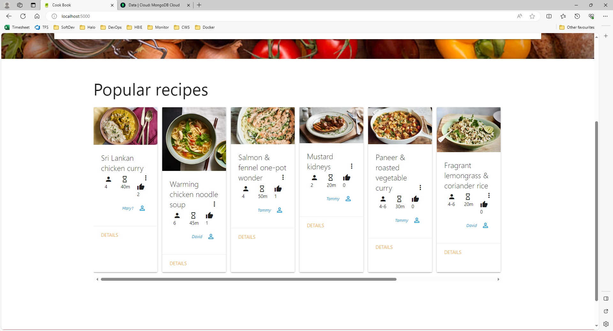

# Testing

## Table of Contents

- [Layout](#layout)
- [Home](#home)
- [Contact](#contact)
- [Search](#search)
- [Login](#login)
- [Register](#register)
- [Account](#account)
- [Change Password](#change-password)
- [Profile](#profile)
- [Recipes](#recipes)
- [Recipe Details](#recipe-details)
- [Edit Recipe](#edit-recipe)
- [Delete Recipe](#delete-recipe)
- [Favourites](#favourites)

## Layout

### Home link works

Before

After

### Log In link works

Before

After

### Register link works

Before

After

### Contact link works

Before

After

### Content attribution link works

Before

After

### Favourite recipes link works

Before

After

### My recipes link works

Before

After

### My account link works

Before

After

### Log out link works

Before

After

 

[↑ Back to top](#testing)

## Home

[Lighthouse Report](documentation/lighthouse-reports/home.pdf)

### Search function works

Before

After

### Popular recipes are in order of most likes

Before

After

 

[↑ Back to top](#testing)

## Contact

[Lighthouse Report](documentation/lighthouse-reports/contact.pdf)

### Message is sent by email

This was working when set up with a Gmail account. Unfortunately the account was blocked for violating Gmail's policies. I was able to set up a Postmark account using my work email which works, but the content of the email is blocked by the company policy. Therefore I've not been able to test this again.

As long as the email environment variables are set to a correct account and host then it should work.

[↑ Back to top](#testing)

## Search

[Lighthouse Report](documentation/lighthouse-reports/search.pdf)

[↑ Back to top](#testing)

## Login

[Lighthouse Report](documentation/lighthouse-reports/login.pdf)

### Login works if username and password are correct

Before

After

### Login fails if username is incorrect

Before

After

### Login fails if password is incorrect

Before

After

 

[↑ Back to top](#testing)

## Register

[Lighthouse Report](documentation/lighthouse-reports/register.pdf)

### Registration succeeds if username is not taken

Before

After

### Registration fails if username is taken

Before

After

 

[↑ Back to top](#testing)

## Account

[Lighthouse Report](documentation/lighthouse-reports/account.pdf)

### View public profile link works

Before

After

### Change password link works

Before

After

 

[↑ Back to top](#testing)

## Change Password

[Lighthouse Report](documentation/lighthouse-reports/change-password.pdf)

### Change password fails if old password is incorrect

Before

After

### Change password succeeds if old password is correct

Before

After

 

[↑ Back to top](#testing)

## Profile

[Lighthouse Report](documentation/lighthouse-reports/profile.pdf)

### Shows profile's user's recipes

Evidence

### Details links work

Before

After

### Profile link works

Before

After

 

[↑ Back to top](#testing)

## Recipes

[Lighthouse Report](documentation/lighthouse-reports/recipes.pdf)

### Shows user's recipes

Evidence

### Create link works

Before

After

### Details link works

Before

After

### Edit link works

Before

After

### Delete link works

Before

After

 

[↑ Back to top](#testing)

## Recipe Details

[Lighthouse Report](documentation/lighthouse-reports/details.pdf)

### Favourite button works

Before

After

### Unfavourite button works

Before

After

### Like button works

Before

After

### Unlike button works

Before

After

### Comment works

Before

After

 

[↑ Back to top](#testing)

## Edit Recipe

[Lighthouse Report](documentation/lighthouse-reports/edit.pdf)

### Change image works

Before

After

### Remove image works

Before

After

### Doesn't allow zero ingredients

Before

After

### Doesn't allow zero steps

Before

After

### Doesn't allow serves from to be greater than serves to

Before

After

 

[↑ Back to top](#testing)

## Delete Recipe

[Lighthouse Report](documentation/lighthouse-reports/delete.pdf)

### Delete button works

[↑ Back to top](#testing)

## Favourites

[Lighthouse Report](documentation/lighthouse-reports/favourites.pdf)

### Shows user's favourites

[↑ Back to top](#testing)
